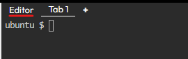
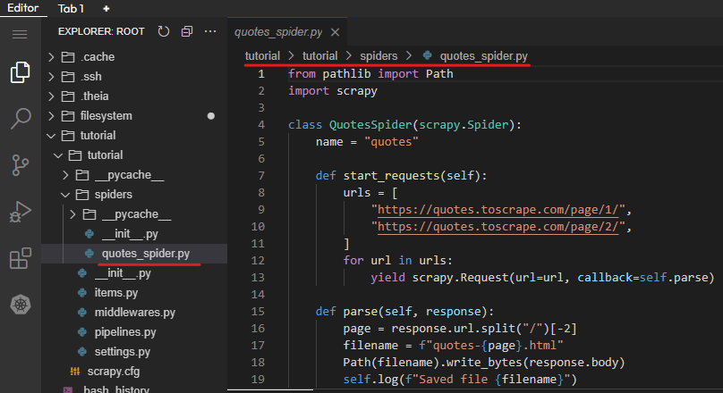

## Creating Your First Scrapy Spider

In Scrapy, the core components responsible for scraping content from web pages are known as **Spiders**. In this tutorial, we will walk you through the process of defining your very first spider to extract data from a website.

### Prerequisites
- Scrapy installed on your environment.

> Ensure you're positioned inside the editor for this activity (refer to the image below).<br>

### Understanding Spiders
Spiders are Python classes that dictate how Scrapy should scrape information from a website. These classes must:
1. Inherit from the `Spider` class provided by Scrapy.
2. Define initial requests to make.
3. Specify how to follow links in the pages (if required).
4. Parse the downloaded page content to extract data.

### Writing Your First Spider

Here's a basic spider designed to scrape quotes from the website `quotes.toscrape.com`. Save this spider in a file named `quotes_spider.py` inside a directory `tutorial/spiders` in your Scrapy project.

```
from pathlib import Path
import scrapy

class QuotesSpider(scrapy.Spider):
    name = "quotes"

    def start_requests(self):
        urls = [
            "https://quotes.toscrape.com/page/1/",
            "https://quotes.toscrape.com/page/2/",
        ]
        for url in urls:
            yield scrapy.Request(url=url, callback=self.parse)

    def parse(self, response):
        page = response.url.split("/")[-2]
        filename = f"quotes-{page}.html"
        Path(filename).write_bytes(response.body)
        self.log(f"Saved file {filename}")
```

> Double-check the directory and filename when storing your spider (refer to the image below).<br>

### Understanding the Spider Components:
- `name`: A unique identifier for the spider.
- `start_requests()`: Generates the initial requests for the spider.
- `parse()`: Handles the downloaded response for each request.

The `parse()` method is particularly important as it not only extracts the data but can also discover new URLs to make additional requests.

## Executing Your Spider
check your current path by using the `pwd` command:
<br>
`pwd`{{exec}}
<br>

If the output from your shell doesn't display `/root/tutorial`, then you'll need to navigate to the correct directory using the `cd` command:
<br>
`cd /root/tutorial`{{exec}}
<br>

Once you have navigated to the root directory of your Scrapy project in your terminal, now execute:
<br>
`scrapy crawl quotes`{{exec}}
<br>

Upon execution, Scrapy will begin scraping the specified URLs. You'll see a series of logs in the console, and upon completion, two new files should appear in your directory: `quotes-1.html` and `quotes-2.html`.

## Conclusion
Congratulations! You've successfully created and executed your first Scrapy spider. If you are wondering why we haven’t parsed the HTML to extract specific data yet, hold on — we will cover that in the next tutorial.
